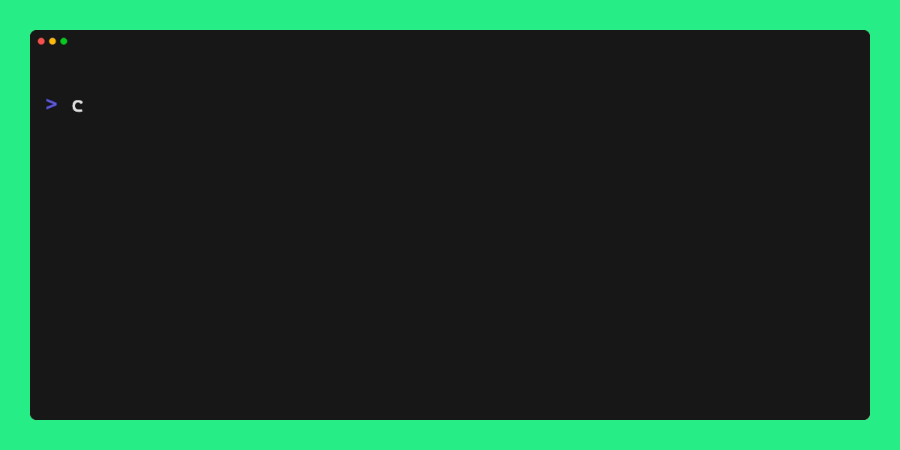

#  committier

Fix and Format commit messages.

<p align="center">
  
</p>

## Features

- Adhere conventioanl commits style
- Compatible with [commitlint](https://github.com/conventional-changelog/commitlint)
- Automatically format once `git commit -m '...'`, see [Git hook setup](#git-hook-setup)
- Automatically adds emojis and is customizable
- Includes a user-friendly commit CLI tool

## What is committier

committier fixes and formats your git commit messages meet the [conventional commit format](https://conventionalcommits.org/). Unlike [commitlint](https://github.com/conventional-changelog/commitlint), it only attempts to format and fix formatting styles without performing strict rules validation. Similar to [Prettier](https://github.com/prettier/prettier/) and [ESLint](https://github.com/eslint/eslint), it integrates well with both.

It does:

- Attemps to format and fix
- Attemps to infer the type, scope, breaking change mark(!), description
- Infer the scope from workspace package names
- Remove extra spaces in the body and footer
- And more...

## Install

`pnpm add committier -D`

`yarn add committier -D`

`npm i committier -D`

Or install globally `pnpm add -g committier`

## Git hook setup

### Using a git hooks manager

[Checkout husky official documentation](https://typicode.github.io/husky/get-started.html)

```sh
pnpm add husky -D
pnpm husky init
```

### Add hook

Edit `.husky/commit-msg`

```sh
npx --no -- committier edit $1
npx --no -- commitlint --edit $1
```

> Note, there is no '--' before 'edit' command in committier but commitlint.

## Commit CLI tool

<p align="center">
  
</p>

```sh
pnpm committier commit
```

Or you can add a script in `package.json` scripts

```json
"commit": "committier commit"
```

Then

```sh
pnpm commit
```

## API

## Config

`.committerrc.json`

Default config:

```json
{
  "autoEmoji": true,
  "autoScope": true,
  "defaultType": "fix",
  "types": {
    "feat": {
      "emoji": "✨",
      "title": "Feature",
      "description": "A new feature"
    },
    "fix": {
      "emoji": "🐛",
      "title": "Bug Fixes",
      "description": "A bug fix"
    },
    "refactor": {
      "emoji": "♻️",
      "title": "Code Refactoring",
      "description": "A code change that neither fixes a bug nor adds a feature"
    },
    "perf": {
      "emoji": "⚡️",
      "title": "Performance Improvements",
      "description": "A code change that improves performance"
    },
    "chore": {
      "emoji": "🎨",
      "title": "Chores",
      "description": "Other changes that don't modify src or test files",
      "scopes": [
        {
          "match": "release",
          "emoji": "🚀",
          "title": "Release",
          "description": "A new release"
        }
      ]
    },
    "test": {
      "emoji": "🧪",
      "title": "Tests",
      "description": "Adding missing tests or correcting existing tests"
    },
    "style": {
      "emoji": "💄",
      "title": "Styles",
      "description": "Changes that do not affect the meaning of the code (white-space, formatting, missing semi-colons, etc)"
    },
    "docs": {
      "emoji": "📝",
      "title": "Documentation",
      "description": "Documentation only changes"
    },
    "revert": {
      "emoji": "➖",
      "title": "Reverts",
      "description": "Reverts a previous commit"
    },
    "build": {
      "emoji": "📦️",
      "title": "Builds",
      "description": "Changes that affect the build system or external dependencies (example scopes: gulp, broccoli, npm)"
    },
    "ci": {
      "emoji": "👷",
      "title": "Continuous Integrations",
      "description": "Changes to our CI configuration files and scripts (example scopes: Travis, Circle, BrowserStack, SauceLabs)"
    },
    "breakingChange": {
      "emoji": "💥",
      "title": "Breaking Changes",
      "description": "Introduce breaking changes."
    }
  }
}
```

## License

ISC
