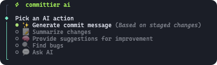
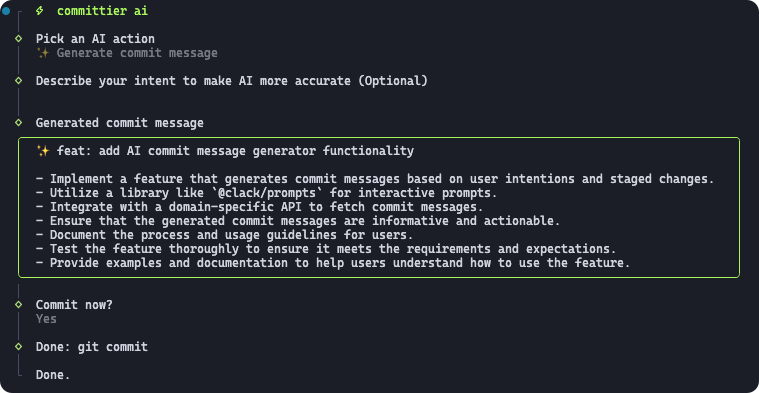

#  committier - Make your commits PRO with ease

<p align="center">

[](https://github.com/iamyoki/committier/actions/workflows/release.yaml)
[](https://github.com/iamyoki/committier/actions/workflows/docs.yaml)
[](https://iamyoki.github.io/committier/)
[](https://www.npmjs.com/package/committier)

</p>

<p align="center">
  committier ❤️ commitlint
</p>

<p align="center">
<a href="https://iamyoki.github.io/committier/" target="_blank">Check out the website 🔗</a>
</p>

> **🌟 AI commit generator is now available in Beta (Free, Local, Light, Zero-Deploy, Fast, CPU friendly)**

<p align="center">
  
</p>

## Features

### committier

- Fix and format rough commit messages into [conventioanl commits](<(https://conventionalcommits.org/)>)
- Adopt [commitlint](https://github.com/conventional-changelog/commitlint)
- Automatically format once `git commit -m '...'`, see [Git hook setup](#git-hook)
- Automatically append emoji, scope, and default commit messages
- User-friendly commit CLI tool
- AI commits generator

### committier ai (Beta)

A completely free, local, light, cpu, zero-deploy AI assitant. Use AI with just one command. No API, no prerequisites and no setup needed.

- ✨ Generate commit message
- 📝 Summarize changes
- 🧠 Provide suggestions for improvement
- 🔍 Find bugs
- 💬 Ask AI

## What is committier

committier fixes and formats your git commit messages meet the [conventional commit format](https://conventionalcommits.org/). Unlike [commitlint](https://github.com/conventional-changelog/commitlint), it only attempts to format and fix formatting styles without performing strict rules validation. Similar to [Prettier](https://github.com/prettier/prettier/) and [ESLint](https://github.com/eslint/eslint), it integrates well with both.

It does:

- Attemps to format and fix
- Attemps to infer the type, scope, breaking change mark(!), description
- Infer the scope from workspace package names
- Remove extra spaces in the body and footer
- And more...

## Install

`pnpm add committier -D`

`yarn add committier -D`

`npm i committier -D`

Or install globally

`pnpm add -g committier`

Or directly execute

`npx committier <command>`

`pnpm dlx committier <command>`

> NOTE: committier ai is now in Beta `pnpm add committier@beta -D`

## Usage

- CLI
  - [format](#format)
  - [edit](#git-hook)
  - [commit](#commit-cli-tool)
  - [ai](#ai)
- [Integrate commitlint](#integrate-commitlint)
- Module API
  - [FormatUseCase](.)
  - [EditUseCase](.)
  - [CommitCLI](.)

## Format

`committier format <message>`

Format and preview the message

## Git Hook

`committier edit <file>`

### Using a git hooks manager

[Checkout husky official documentation](https://typicode.github.io/husky/get-started.html)

```sh
pnpm add husky -D
pnpm husky init
```

### Add hook

Edit `.husky/commit-msg`, add `npx --no -- committier edit $1`

```diff
+ npx --no -- committier edit $1
npx --no -- commitlint --edit $1
```

> Note, there is no '--' before 'edit' command in committier but commitlint.

## AI

`committier ai`





## Commit CLI Tool

`committier commit`

<p align="center">
  
</p>

```sh
pnpm committier commit
```

Or you can add a script in `package.json`

```json
{
  "scripts": {
    "commit": "committier commit",
    "commit:ai": "committier ai"
  }
}
```

Then

```sh
pnpm commit
```

### Test and preview commit with `dry-run` mode

It's useful if you only want to test the commit experience.

`committier commit --dry-run`


## Integrate [commitlint](https://github.com/conventional-changelog/commitlint)

Make sure **commitier** runs before **commitlint**

`.husky/commit-msg`

```sh
npx --no -- committier edit $1
npx --no -- commitlint --edit $1
```

If your enabled `autoEmoji: true` (default: true), make sure to set our `commitlintEmojiParser`, because commitlint doesn't accept any emoji by default.

`commitlint.config.js`

```js
import { commitlintEmojiParser } from "committier/commitlint-emoji-parser"";

export default {
  extends: ["@commitlint/config-conventional"],
  parserPreset: commitlintEmojiParser,
};
```

## API

## Config

Create a `.committerrc.json` file at root, you can partially add fields to override the default config.

Default config:

```json
{
  "autoEmoji": true, // boolean
  "autoScope": false, // boolean | 'replaceToPackageName' (true) | 'defaultToPackageName'
  "defaultType": "fix",
  "defaultDescription": false, // boolean | "fileName" (true) | "fileBasename" | "filePath"
  "types": {
    "feat": {
      "emoji": "✨",
      "title": "Feature",
      "description": "A new feature"
    },
    "fix": {
      "emoji": "🐛",
      "title": "Bug Fixes",
      "description": "A bug fix"
    },
    "refactor": {
      "emoji": "♻️",
      "title": "Code Refactoring",
      "description": "A code change that neither fixes a bug nor adds a feature"
    },
    "perf": {
      "emoji": "⚡️",
      "title": "Performance Improvements",
      "description": "A code change that improves performance"
    },
    "chore": {
      "emoji": "🎨",
      "title": "Chores",
      "description": "Other changes that don't modify src or test files",
      "scopes": [
        {
          "match": "release",
          "emoji": "🚀",
          "title": "Release",
          "description": "A new release"
        }
      ]
    },
    "test": {
      "emoji": "🧪",
      "title": "Tests",
      "description": "Adding missing tests or correcting existing tests"
    },
    "style": {
      "emoji": "💄",
      "title": "Styles",
      "description": "Changes that do not affect the meaning of the code (white-space, formatting, missing semi-colons, etc)"
    },
    "docs": {
      "emoji": "📝",
      "title": "Documentation",
      "description": "Documentation only changes"
    },
    "revert": {
      "emoji": "➖",
      "title": "Reverts",
      "description": "Reverts a previous commit"
    },
    "build": {
      "emoji": "📦️",
      "title": "Builds",
      "description": "Changes that affect the build system or external dependencies (example scopes: gulp, broccoli, npm)"
    },
    "ci": {
      "emoji": "👷",
      "title": "Continuous Integrations",
      "description": "Changes to our CI configuration files and scripts (example scopes: Travis, Circle, BrowserStack, SauceLabs)"
    },
    "breakingChange": {
      "emoji": "💥",
      "title": "Breaking Changes",
      "description": "Introduce breaking changes."
    }
  }
}
```

## License

ISC
